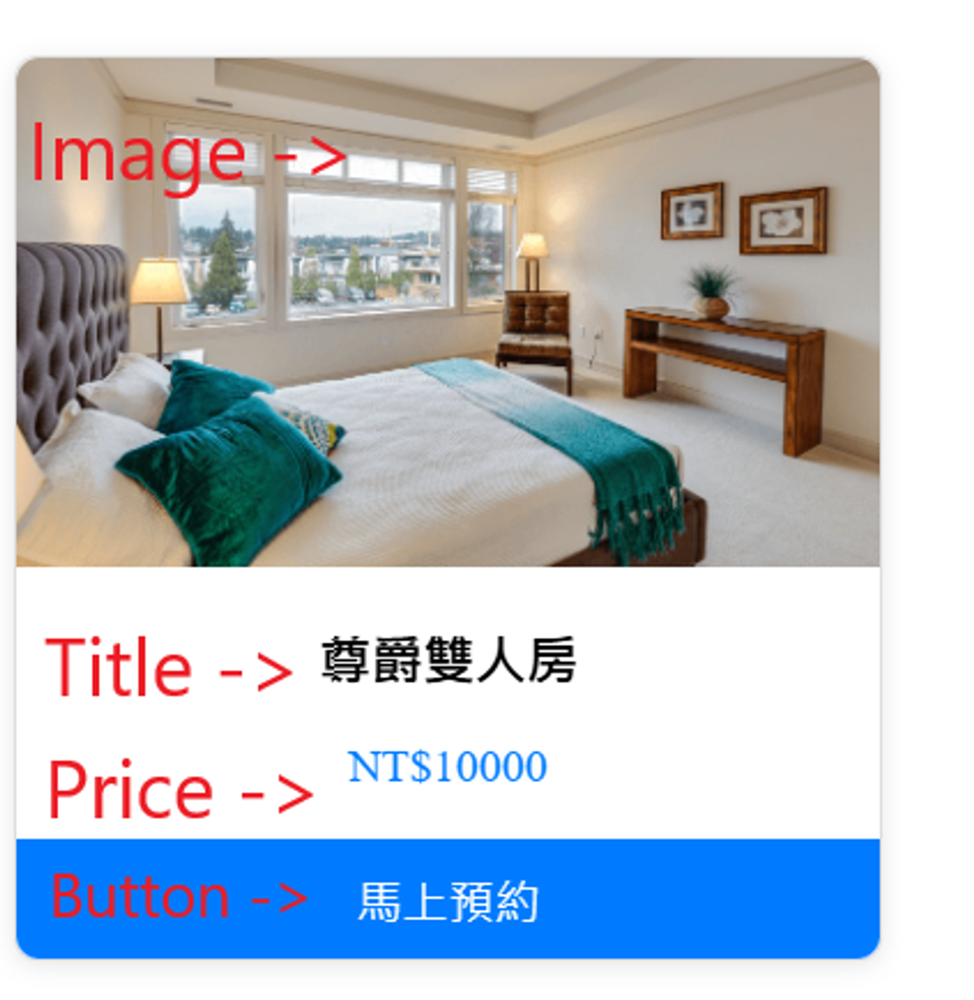

# Day5 - 使用指令建立 Composables 題目



請 clone 這一份模板，完成以下條件 :

- 在 pages/index.vue 使用 ES6 fetch 或是 axios 串接前台 [最新消息 API ( GET )](https://nuxr3.zeabur.app/swagger/#/Home%2FNews%20-%20%E6%9C%80%E6%96%B0%E6%B6%88%E6%81%AF) ，將資料寫入 newsList 並且切換 Loading 元件開啟、關閉的狀態。
- 將 newsList 資料在 <NewsCard  /> 以 v-for 渲染卡片，並將 props 傳入<NewsCard  /> 元件
- **將資料和 API 的方法移至 composables/useHome.js ，改成使用 composable 引入方法與資料**

## 安裝

以下將會引導你如何安裝此專案到你的電腦上。

Node.js 版本為：`20.18.0`

### 取得專案

```bash
git clone -b day5-composable git@github.com:letcla0624/nuxt3-daily-hw.git day5-composable
```

### 環境變數設定

請在終端機輸入 `cp .env.example .env` 來複製 .env.example 檔案。

## Setup

Make sure to install dependencies:

```bash
# npm
npm install

# pnpm
pnpm install

# yarn
yarn install

# bun
bun install
```

## Development Server

Start the development server on `http://localhost:3000`:

```bash
# npm
npm run dev

# pnpm
pnpm dev

# yarn
yarn dev

# bun
bun run dev
```

## Production

Build the application for production:

```bash
# npm
npm run build

# pnpm
pnpm build

# yarn
yarn build

# bun
bun run build
```

Locally preview production build:

```bash
# npm
npm run preview

# pnpm
pnpm preview

# yarn
yarn preview

# bun
bun run preview
```

Check out the [deployment documentation](https://nuxt.com/docs/getting-started/deployment) for more information.
