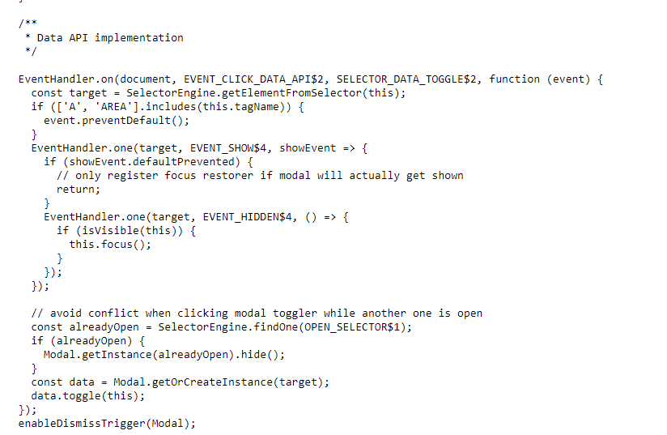

# Day 9 - $fetch 與 ofetch 題目



請 clone 這一份模板，實作帳號註冊功能 :

- 在 `/pages/register.vue` 使用模板提供的操作介面填寫註冊表單。點擊 “註冊” 按鈕後使用 Nuxt3 提供的方法串接旅館的 [註冊 API](https://nuxr3.zeabur.app/swagger/#/Users%20-%20%E4%BD%BF%E7%94%A8%E8%80%85/post_api_v1_user_signup) ，將請求送出。
- 需使用 try catch 處理請求成功與失敗的訊息，請求成功與失敗皆使用 [sweetAlert2 套件](https://sweetalert2.github.io/)顯示訊息。sweetAlert2 套件在模板已有安裝與引入，不需再額外設定。

```jsx
$swal.fire({
  position: "center",
  icon: ... ,
  title: ... ,
  showConfirmButton: false,
  timer: 1500,
});
```

- 表單不需處理表單驗證、身分驗證、檢查登入狀態以及存入 cookie。
- [註冊 API](https://nuxr3.zeabur.app/swagger/#/Users%20-%20%E4%BD%BF%E7%94%A8%E8%80%85/post_api_v1_user_signup) 夾帶的請求體（Request Body）格式，需要注意以下地方 :
  - 所有欄位都必填。
  - 密碼需要至少 8 碼以上，並英數混合。
  - 電話格式可以是手機號碼與市內電話。
  - birthday 格式可以是 "yyyy-mm-dd”。
  - zipcode 需要對照到各縣市各區的郵遞區號，可以參考 [郵遞區號速查一覽表](https://c2e.ezbox.idv.tw/zipcode.php)。
- 串接 API 時需避免在伺服器端與客戶端重複發送請求。

## 安裝

以下將會引導你如何安裝此專案到你的電腦上。

Node.js 版本為：`22.11.0`

### 取得專案

```bash
git clone -b day9-nuxt-fetch https://github.com/letcla0624/nuxt3-daily-hw.git day9-nuxt-fetch
```

### 環境變數設定

複製 .env.example 檔案給 .env。

```bash
cp .env.example .env
```

## Setup

Make sure to install dependencies:

```bash
# npm
npm install

# pnpm
pnpm install

# yarn
yarn install

# bun
bun install
```

## Development Server

Start the development server on `http://localhost:3000`:

```bash
# npm
npm run dev

# pnpm
pnpm dev

# yarn
yarn dev

# bun
bun run dev
```

## Production

Build the application for production:

```bash
# npm
npm run build

# pnpm
pnpm build

# yarn
yarn build

# bun
bun run build
```

Locally preview production build:

```bash
# npm
npm run preview

# pnpm
pnpm preview

# yarn
yarn preview

# bun
bun run preview
```

Check out the [deployment documentation](https://nuxt.com/docs/getting-started/deployment) for more information.
